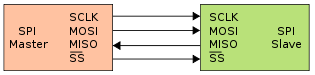

## **How I Changed my Pro Micro Fuse bits**

**Pick an AVR Programmer**  
I used an [USBtinyISP Programmer](Pics/USBtinyISP%20Programmer.jpg) with a custom wire harness to connect a Pro Micro.  
Harness is a single 3x2 Female JST connector wired into a dual 4x1 Female JST connector, or  
ICSP (In Circuit Serial Programming) 6-Pin Cable coverted to Arduino Pro Micro headers.
[See here](Pics/USBtinyISP-Programmer+DIY-Harness.jpg)  
  
via SPI (Serial Peripheral Interface) pins SCLK, MOSI, MISO, SS (Pro Micro holds low)  

32u4 Pin |Data |wire   |USBtiny Row/Col
--- |---- |------ |--------
10  |D10  |empty  | - - -
16  |MOSI |Yellow | 1 / 2
14  |MISO |Green  | 2 / 3
15  |SCK  |Blue   | 2 / 2
#21  |Vcc  |Red    | 1 / 3
#22  |RST  |Blue   | 2 / 1
#23  |Gnd  |Black  | 1 / 1
#24  |Raw  |empty  | - - -

**On your computer,**  
Download and install [AVRDUDESS](https://blog.zakkemble.net/avrdudess-a-gui-for-avrdude/) - GUI version of AVRDUDE.  
Download and install [USBtinyISP drivers](https://learn.adafruit.com/usbtinyisp/download) - follow link to GitHub.   
Download and install [Notepad++](https://notepad-plus-plus.org/) to edit XML file *'C:\Program Files (x86)\AVRDUDESS\bits.xml'* or any other software to edit XML files.  
If you use [Arduino IDE](https://www.arduino.cc/en/Main/Software&), I believe that includes a copy of AVRDUDE within the install package. 

Before starting **AVRDUDESS**,  
you will need to add XML *'mcu'* tag group including attributes for your ATMega32U4 MCU.  
Attributes for High/Low/Extended & Lock bits can be found in the three manual pages listed below  

ATmel manual for ATMega32U4 pages: 346 - 348  
[Lock bits](ICSP_Pics/ATMega32U4%20-%20Lock%20bits.jpg), 
[Extended bits](ICSP_Pics/ATMega32U4%20-%20Fuse%20bits%20-%20Extended.jpg), 
[High/Low bits](ICSP_Pics/ATMega32U4%20-%20Fuse%20bits%20-%20High%20%26%20Low.jpg)  

Start **Notepad++** and load XML file *'C:\Program Files (x86)\AVRDUDESS\bits.xml'*.  
You can collaspse (Alt+2) & uncollaspse (Alt+Shift+2) extra *'mcu'* tags.  
(Keep *'atmega32'* & *'atmega328p'* visible.)  
Copy and paste *'atmega328p'* XML *'mcu'* tag group (6 lines)  
insert after *'atmega32'* and change name to *'atmega32u4'*.  
Note: 'Bit No', and 'Bit Byte name' from ATmel pages as you will need to change or add a few 'Bit Byte names'.  
When finished should look like [AVRDUDESS - Configure *'bits.xml'*](ICSP_Pics/AVRDUDESS%20bits.xml%20file%20update%20for%20Fuse%20%26%20Lock%20Bits.jpg)  
Save your updated bits.xml file.  

Your MCU 'signature' can be verified by starting **AVRDUDESS** with  
**Programmer:** `USBtiny` ladyada version  
**Port:** `USB`  

Connect your Pro Micro to your custom wired harness(dual connectors side).  
Confirm and connect to the ICSP header(6-pin side) on your USBtinyISP.  
Connect the USB A/B cable.  
Your computer should find your AVR programmer.  
You may need to check `Start, Control Panel, System, Device Manager` for any device driver issues.
[USBtiny-Device Manager](ICSP_Pics/USBtiny%20-%20Device%20Manager.jpg)  

If everything is Okay, Start **[AVRDUDESS](ICSP_Pics/AVRDUDESS.jpg)**,  
configure: Programmer & Port  
Select your MCU from drop-down list  
click on `Detect` - Your MCU/signature should respond.  
Update bits.xml with your MCU signature.   
Update bits.xml with any differences or missing Bit names  
under high, low, ext, lock tags. (8 Bit names per Byte, some are blank).  

Restart AVRDUDESS  
configure: Programmer & Port  
Select your MCU from drop-down list  
click on `Read` for both 'Fuses & lock bits'  
click on `Manage` and save a preset for your Pro Micro - also write down your defaults programmed into your micro-controller.  

click on `Bit selector` it should now show the breakout of your 'Fuse & Lock bits'  
[AVRDUDESS - Fuse & Lock bits](ICSP_Pics/AVRDUDESS%20Fuse%20%26%20Lock%20Bits.jpg)  
'Fuse & Lock bits' panel should allow changes to bits and recalculate the new byte value.  
Use **caution** when reprograming Fuse bits (L-FF, H-D8, E-C8) & Bootloader,  
as incorrect settings may brick your microcontroller.  
I recommend only changing **JTAGEN** bit,  
unless you are thoroughly read on the operation of your micro-controller chip.  
Fuse bits are only changed when you do a physical write by click on `Write`  

**Proceed at own risk.**  

Good Luck - and May the Trackball Twinkle in Multiple Colours!
