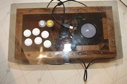

## **Arcade-Trackball** 
Arcade Trackball - based off Spinner version 2

  
**Using an Arduino Pro Micro - DIY Trackball Controller**  
At sub $10 USD, it is a substitute to Ultimarc's U-HID Nano @ $35 + shipping - You do the HID device coding...   **Code to follow**  
New additional interrupts, movement y-axis processing and both x/y axes handling. 
Oct 12/20: Code now availble, see extra pictures of finished Trackball box.  
Dec 16/20: Added code for x-axis disable (Golf game driver - no hook/slice cheat)  
Dec 16/20: Uploaded new code for override Joystick directions mod (using buttons for menu)  
This project uses an Arduino Pro Micro clone, arcade trackball, with 8 buttons (up to 10) for use with MAME or any other emulator which can use x-axis and y-axis of mouse device as a trackball controller. Code should work on any board using an ATmega32U4 as long as the port pins are mapped to the same "digital pins" as the [Pro Micro](Pics/Arduino%20Pro%20Micro%20Atmega32u4.jpg).  
To construct, you will need an older non-PS/2 style trackball which can operate at 5v along with some momentary switches plus Arduino micro controller. 
This [trackball](Pics/Retro%20Arcade%203in%20Trackball%20and%20Harness.jpg), RA-TRACKBALL-2, uses the [red Opto boards](Pics/Red_Board_Pinout.jpg), A052-1011-00, and not the green PS/2 Opto board pair. It is unknown if the Jamma 60-in-1 (6-pin header) style trackballs use quadrature rotary encoder pulses for x/y axes like for Game Elf Jamma 138/276/352/485/619/1162-in-1, etc. (10-pin header/dual player) boards or board pair output PS/2 (DIR/CLK) protocol. AliExpress does show a Jamma 60-in-1 board with trackball using 6-pin header & 10-pin header harness, but would require closer look at encoder boards.  
[**TrackBall** used](https://www.amazon.ca/gp/product/B00F1YQH6G/ref=ppx_yo_dt_b_asin_title_o01_s00?ie=UTF8&psc=1) (clone of SuzoHapp style trackball by RetroArcade.us) 
[**ATmega32U4** used](https://www.amazon.ca/gp/product/B01N4TVIQX/ref=ppx_yo_dt_b_asin_title_o02_s00?ie=UTF8&psc=1) (clone of SparkFun Pro Micro) 
 

You will need Arduino joystick library at: [https://github.com/MHeironimus/ArduinoJoystickLibrary](https://github.com/MHeironimus/ArduinoJoystickLibrary)  
Matthew Heironimus joystick code: [Joystick.cpp](https://github.com/MHeironimus/ArduinoJoystickLibrary/blob/master/src/Joystick.cpp) & 
[Joystick.h](https://github.com/MHeironimus/ArduinoJoystickLibrary/blob/master/src/Joystick.h) or 
Download: [master.zip](https://github.com/MHeironimus/ArduinoJoystickLibrary/archive/master.zip)  
In Arduino IDE:
- Select Sketch 
- Include Library 
- Add .ZIP Library... 
- Browse to downloaded ZIP file 
- Click Open

The Joystick library's examples will now appear under File > Examples > Joystick.   

This device will be detected as both mouse and joystick/gamepad. The joystick only has X and Y axes which we don't use. At least one axis is needed by the library to declare the joystick and it was found that 2 were required for the controller to be detected by RetroPie. We just center the X and Y axes in setup() and forget about them. The trackball controls the mouse X & y axes which is by default mapped to the mouse in MAME (don't forget to enable the mouse in MAME under advanced options!). The buttons will work as regular gamepad/joystick buttons. The 3" trackball is attached to a 24 slot wheel with gear(roller) ratio of about x7 (3.000"/0.425") = 169.412 slots/rev and  677.65 pulses/rev This is less than a spinner 600p/r or 2400 pulses or half effective movement in the micro controller software. Hand movement of 9.42"/rev.  
The code uses the Atmega32u4 ports directly because that's faster (over x30) than using digitalRead/Write. No button debouncing is setup, but can be added depending on your hardware issues.  

**Extra info:** 
Wiring: [See diagram](Pics/Trackball%20Sketch_bb.jpg)  
Vcc (+5V) and Gnd output wires red and black 
Trackball A(XA), B(XB), C(YA) & D(YB) output wires purple, blue, yellow and green. 
Note: resistor used in series to limit current around 10mA (390Ω	- 470Ω).  
&nbsp;&nbsp;&nbsp;&nbsp;&nbsp;&nbsp;&nbsp;&nbsp;&nbsp;&nbsp;Red Opto boards have LMC662CM (Dual Op Amp) acting as output buffer with 21-22mA limits 
Buttons 1-6, plus 9-select(coin), and 10-start(player) 

Pin |Data |Button/wire  |Code
--- |---- |------------ |----
0   |D1   |YA trackball - Yellow |PinD
1   |D0   |YB trackball - Green |PinC
2   |D2   |XB trackball - Blue |PinA
3   |D3   |XA trackball - Purple |PinB
4   |D4   |Button 1 - X
5   |D5   |Button 2 - A
6   |D6   |Button 3 - B
7   |D7   |Button 4 - Y
8   |D8   |Button 5 - L
9   |D9   |Button 6 - R
10  |D10  |Button 9 - Select
15  |D15  |Button 10 - Start
Gnd |     |Gnd - Black
Vcc |     |+5v - Red   

I believe the trackball encoder A/B output is reversed as you move the ball and not the roller directly. The code has been tested and trackball moves in the proper direction, so, the code was left as is. The Opto encoder board is also used for steerwheel devices. I am using Xbox A/B, X/Y configuration, Nintendo protocol is B/A, Y/X reversed controls (Japanese cultural differences). 
You can assign buttons to any assignment in RetroArch but it is best to pick a consistent pattern across all controllers to avoid confusion.   
   
**The Code:** 
There are two versions of code: Pick your code to use
- Standard Mouse and Joystick buttons version  
  - [Trackball_8-Button.ino](Trackball_8-Button.ino)
- Standard Mouse and Joystick buttons version - mod Joystick directions (use buttons for menu)
  - [Trackball_8-Button-mod.ino](Trackball_8-Button-mod.ino)  

**Extra expenses:**  
Dupont connectors 2.54mm pitch JST SM kit (requires special crimper)  
or female Dupont pre-wired bundles with spare wire 24-28AWG (stranded wire for flexiblity)  
Sanwa - 2.8mm(0.110") or Suzo-Happ - 4.8mm(0.187") female spade crimp connectors for arcade button ends  
 
**For the more observant** in pictures 
"[Inside Spaghetti](Special%20Testing%20Pics/Inside%20spaghetti.jpg)" and 
"[Arduino Beauty Shot](Special%20Testing%20Pics/Arduino%20beauty%20shot.jpg)" 
there's an extra wire harness and aligator clip hooking to Gnd. TX0 & RX1 are wired to the y-axis of a proto-type [Trackball](https://www.amazon.ca/gp/product/B00F1YQH6G/ref=ppx_yo_dt_b_asin_title_o01_s00?ie=UTF8&psc=1) setup. Arduino code has been modified, tested and confirmed to work. No stutter or lag as using only USB protocol to RetroPie. No PS/2 Protocol overhead. I will be working on enclosure to finish new controller for games like **Centipede**, **Marble Madness**, **Crystal Castles**, and others.  

RetroPie [laggy trackball](laggy_mouse.md) issues  

**More pictures:**   
The assembled pictures before adding clear finish to antique oak wood box 
"[See-thru-Top](Finished%20pictures/See-thru-Top.jpg)", 
"[Bottom-side](Finished%20pictures/Bottom-side.jpg)", 
"[ATmega32U4 wired inside](Finished%20pictures/ATmega32U4%20wired%20inside.jpg)", 
"[Buttons](Finished%20pictures/Buttons.jpg)", 
"[Trackball](Finished%20pictures/Trackball.jpg)".
The top, I used tinted Polycarbonate sheet (0.120" thick) found at a local surplus store and bottom from wood sitting in my parents basement from early 60's sourced from Stelco for handling steel. I later found out the wood was very dense, hard oak 100 to 120 years old from sapling. I snapped a few #4 screws while assembling which staled progress. Bottom panel is 3/16" - 1/4" plywood insert - 15⅞" x 7⅞".  

**The Box:**  
The wood box measures 17" x 9" x 3⅞" in size, with a 19" x 11" Lexan top - [Trackball box](Pics/TrackBox%20Layout%20dimensions.png) dimensions;  
wood sides have 7/16" rabbet butt joints glued, and 7/16" rabbet along inside bottom edge to allow plywood panel to recess in flush.  
The outside bottom edge has a ¼ round routered edge. Physical dimensions of [Trackball](Pics/RA-Trackball-2%20dimensions.jpg) are shimmed by four wooden blocks on right side, bottom side, and two on the bottom. Block dimensions will vary with your own inside/outside box dimensions; leave space under ball to allow lighting and "Dust Bunny" particles to fall through. 
